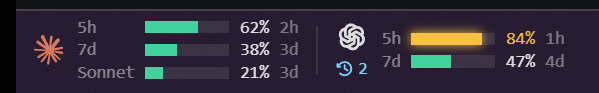
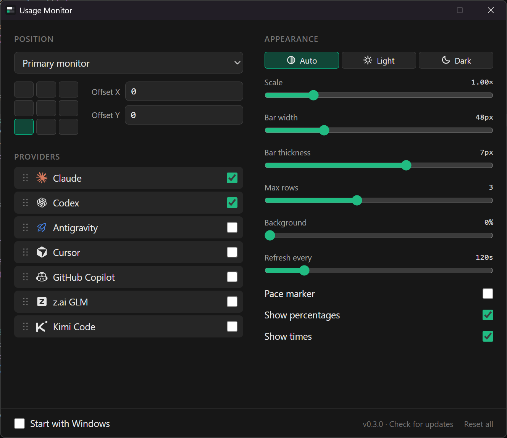

# Usage Monitor

A small Windows overlay that shows AI coding plan rate limits (Claude Code, Codex, Antigravity,
Cursor, GitHub Copilot, z.ai GLM, Kimi Code) on top of the taskbar.
It lives in the system tray; there is no main window.

Built with Tauri 2, Svelte 5 and Tailwind 4.



Each row is one limit window: used percentage and time until it resets. Bars turn amber at 70%
and red at 90%. An optional pace marker shows how much of the window has elapsed.



## Data sources

Claude
- `%TEMP%\claude-statusline-*\usage-cache.json` if a status line script has cached the usage
  response in the last 3 minutes. No request is made in that case.
- Otherwise `GET api.anthropic.com/api/oauth/usage` with the token from
  `~/.claude/.credentials.json`. On HTTP 429 it waits for `Retry-After`.

Codex
- `GET chatgpt.com/backend-api/wham/usage` with the token from `~/.codex/auth.json`.
- Falls back to the last `rate_limits` entry in the newest `~/.codex/sessions` log.

Antigravity
- `GetUserStatus` on the running Antigravity language server (port and CSRF token are read
  from its process).
- Otherwise `cloudcode-pa.googleapis.com/v1internal:fetchAvailableModels` with the OAuth token
  from Antigravity's `state.vscdb`. If it has expired it is refreshed in memory, with the OAuth
  client read from the installed Antigravity CLI (`agy`) or IDE.

Cursor
- `GET cursor.com/api/usage-summary` with the session token from Cursor's `state.vscdb`.

GitHub Copilot
- `GET api.github.com/copilot_internal/user` with the GitHub CLI token (`gh auth token`).

z.ai GLM Coding Plan
- `GET api.z.ai/api/monitor/usage/quota/limit` with the API key entered in settings.

Kimi Code
- `GET api.kimi.com/coding/v1/usages` with the token from `~/.kimi-code/credentials`.

Providers other than Claude and Codex are off until enabled in settings. Credential files are only
read, never written. All endpoints are undocumented and may change.
The last successful result per provider is cached, so the overlay shows the last known values
when a request fails.

## Install

Download the installer from [Releases](https://github.com/patrickiel/usage-monitor/releases/latest)
and run it. It installs for the current user and needs no admin rights. Settings are stored in
`%APPDATA%\dev.patrickiel.usage-monitor`.

## Development

Requires Node, pnpm and a Rust toolchain.

```
pnpm install
pnpm tauri dev
pnpm check      # svelte-check
pnpm release    # installer in src-tauri/target/release/bundle/nsis
```

`VITE_DEMO=1 pnpm tauri dev` replaces provider data with fixed sample values
(`src/providers/demo.ts`), which is how the screenshots above were taken.

## Adding a provider

Implement `Provider` from `src/providers/types.ts` and add it to the list in
`src/providers/index.ts`:

```ts
export const example: Provider = {
  id: 'example',
  name: 'Example',
  icon: SomePhosphorIcon,
  async fetch({ key }) {
    return {
      bars: [{ label: '5h', percent: 42, resetsAt: new Date(), windowSeconds: 5 * 3600 }],
      fetchedAt: new Date(),
    };
  },
};
```

Set `keyLabel` if the provider needs an API key; settings then shows an input for it.
Files outside the home folders already in scope, or new hosts, need to be allowed in
`src-tauri/capabilities/default.json`.
